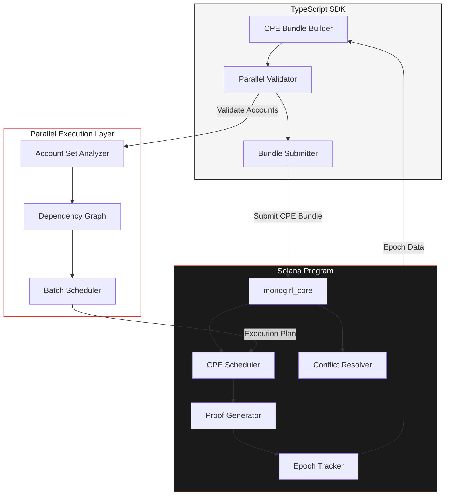

<p align="center">
  
</p>

<h1 align="center">monogirl</h1>

<p align="center"><strong>Conditional Parallel Execution on Solana. The Anti-Jito.</strong></p>

<p align="center"><em>Proof of synchronicity.</em></p>

<p align="center">
  <a href="https://github.com/mgirl-labs/monogirl/actions/workflows/ci.yml">
    
  </a>
  <a href="https://github.com/mgirl-labs/monogirl">
    
  </a>
  <a href="https://github.com/mgirl-labs/monogirl/blob/main/LICENSE">
    
  </a>
  
  
  <a href="https://x.com/mgirl_fun">
    
  </a>
  <a href="https://mgirl.fun">
    
  </a>
</p>

<hr />

## What is Conditional Parallel Execution

Jito guarantees sequential ordering: transaction A runs before B. MonoGirl guarantees the opposite -- parallel ordering: transactions A and B execute in the same parallel batch on Sealevel.

CPE bundles specify a set of transactions along with the conditions under which they must run concurrently. The on-chain program validates account set independence, schedules parallel batches, and generates a proof of synchronous execution.

| | Jito | MonoGirl |
|---|---|---|
| Ordering | Sequential (A then B) | Parallel (A and B together) |
| Use case | MEV extraction | MEV protection, atomic parallelism |
| Execution model | Ordered bundles | CPE bundles |
| Token | JTO | $MONO |

## Architecture



## Usage

### Submitting a CPE Bundle

```typescript
import { CPEClient, BundleConfig } from "./monogirl-sdk";

const client = new CPEClient({
  rpcUrl: "https://api.mainnet-beta.solana.com",
  programId: "Fg6PaFpoGXkYsidMpWTK6W2BeZ7FEfcYkg476zPFsLnS",
});

const bundle = await client.createBundle({
  transactions: txList,
  epoch: currentEpoch,
  maxDepth: 8,
});

const result = await client.submitBundle(bundle);
console.log("CPE proof:", result.signature);
```

### CLI Usage

```bash
# Create a CPE bundle from transaction set
monogirl-cli bundle --input transactions.json --epoch 420

# Verify parallel execution proof
monogirl-cli verify --proof proof.json

# Inspect dependency graph
monogirl-cli inspect --dag-output dag.dot
```

## Contributing

Contributions are welcome. Please read [CONTRIBUTING.md](./CONTRIBUTING.md) for guidelines on how to submit pull requests.

## Installation

### Prerequisites

- Rust 1.75+ with cargo
- Node.js 18+ with npm
- Solana CLI 1.17+
- Anchor Framework 0.29+

### Clone and Build

```bash
git clone https://github.com/mgirl-labs/monogirl.git
cd monogirl

# Build Rust programs
cargo build --release

# Install SDK dependencies
cd sdk && npm install
```

### Run Tests

```bash
# Rust unit tests
cargo test

# TypeScript SDK tests
cd sdk && npm test
```

## Features

| Feature | Description |
|---------|-------------|
| CPE Bundle Validation | Validates account set independence for parallel execution eligibility |
| Parallel Batch Scheduling | Assigns transactions to Sealevel parallel batches based on dependency graphs |
| Proof of Synchronicity | Generates on-chain proof that transactions executed in the same slot and batch |
| Epoch-Aware Processing | Tracks Solana epochs for proof validity windows |
| Conflict Resolution | Deterministic resolution when account sets overlap |
| TypeScript SDK | Client library for CPE bundle submission and proof querying |
| CLI Tools | Command-line interface for bundle creation and inspection |

## License

This project is licensed under the MIT License. See [LICENSE](./LICENSE) for details.


